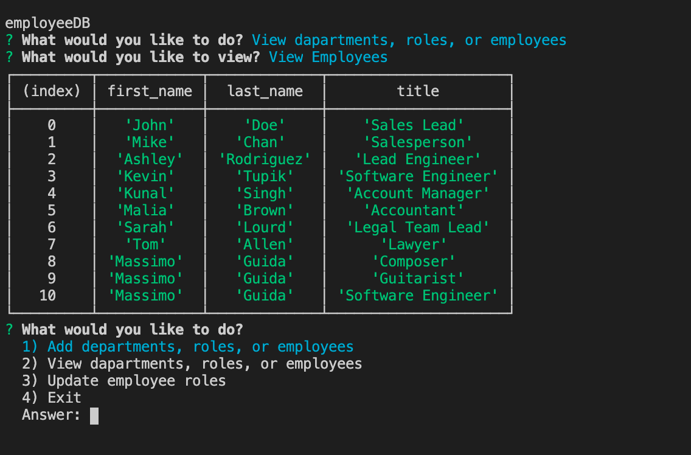

# Assignment 12: Employee Tracker

## User Story
AS a business owner
I WANT to be able to view and manage the departments, roles, and employees in my company
SO THAT I can organise and plan my business

## Description
* The following CLI application allows users to organise their business and manage the departments, roles, and employees in their company
* It allows the user to create or view departments, roles, or employees, and to update employee roles as well

## Usage
* To run this CLI application, first clone the GitHub repository onto your local device
* The User should then run 'npm install' inside the project root directory
* The User should then run the 'server.js' file using node through GIT, by using one of the following commands: 
    * 'node server.js' or
    * 'npm start'
* Through the CLI, the user will be prompted with a number of options including
    * Whether they would like to add:
        * A new department
        * A new role
        * A new employee
    * Whether they would like to view:
        * All departments
        * All roles
        * All employees
    * Whether they would like to update an employee's role by changing the employee's "Role ID"
    * Whether they would like to exit the CLI application

## Application Screenshot

## Accessories Used
### Languages
* JavaScript
* JSON
* ES6+
* APIs

### Programs and Applications
* [Node.js](https://nodejs.org/en/)
* [MYSQL](https://www.mysql.com/) (Databases)
* Git/Terminal

### Packages
* [Express](https://expressjs.com/)
* Inquirer
* fs

### Websites
* [GitHub](https://github.com/)

## Deployed Links:
* GitHub Repository URL: https://github.com/MG-cpu90/assignment12